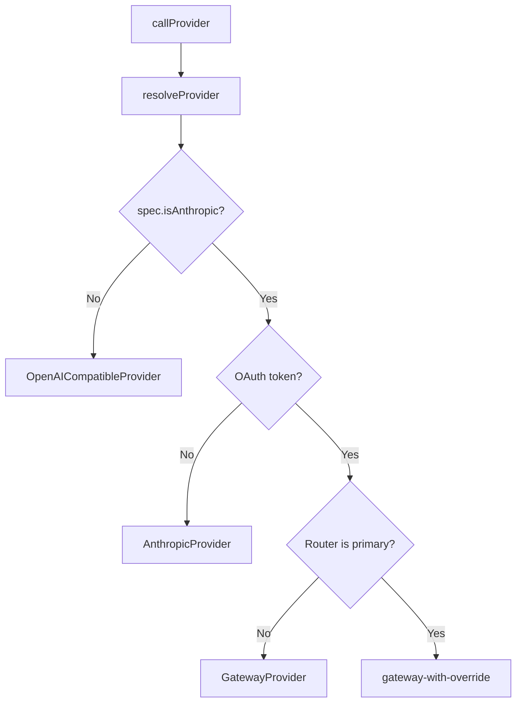

# Adding a New Provider

This guide explains how to add a new LLM provider to the claw-llm-router.

## Overview

The router uses a **Strategy pattern** — each provider implements the `LLMProvider` interface and handles its own request/response format. The provider registry (`providers/index.ts`) picks the right provider based on the model spec.



## The `LLMProvider` Interface

Every provider implements this contract from `providers/types.ts`:

```typescript
interface LLMProvider {
  readonly name: string;
  chatCompletion(
    body: Record<string, unknown>,        // Original OpenAI-format request
    spec: { modelId: string; apiKey: string; baseUrl: string },
    stream: boolean,
    res: ServerResponse,
    log: PluginLogger,
  ): Promise<void>;
}
```

### Parameters

- `body` — The original request body in OpenAI chat completions format
- `spec` — Provider details (model ID, API key, base URL) resolved from tier config
- `stream` — Whether the client requested streaming SSE
- `res` — Node.js `ServerResponse` to write the response to
- `log` — Logger with `info()`, `warn()`, `error()` methods

### Contract

- **Non-streaming**: Write a complete JSON response to `res` with `Content-Type: application/json`
- **Streaming**: Write SSE events to `res` with `Content-Type: text/event-stream`, ending with `data: [DONE]\n\n`
- **Errors**: Throw an `Error` — the proxy's fallback chain will catch it and try the next tier
- **Response format**: Must be OpenAI chat completions format (the proxy expects it)

## Step-by-Step Guide

### 1. Create `providers/my-provider.ts`

```typescript
import type { ServerResponse } from "node:http";
import type { LLMProvider, PluginLogger } from "./types.js";

export class MyProvider implements LLMProvider {
  readonly name = "my-provider";

  async chatCompletion(
    body: Record<string, unknown>,
    spec: { modelId: string; apiKey: string; baseUrl: string },
    stream: boolean,
    res: ServerResponse,
    log: PluginLogger,
  ): Promise<void> {
    // 1. Convert request if needed (OpenAI format → provider format)
    // 2. Make the API call with fetch()
    // 3. Convert response back to OpenAI format if needed
    // 4. Write to res (JSON for non-streaming, SSE for streaming)
  }
}
```

### 2. Add to `providers/index.ts`

```typescript
import { MyProvider } from "./my-provider.js";

const myProvider = new MyProvider();

export function resolveProvider(spec: TierModelSpec): LLMProvider {
  if (spec.provider === "my-provider") {
    return myProvider;
  }
  // ... existing logic
}
```

### 3. Add well-known base URL to `tier-config.ts`

In the `WELL_KNOWN_BASE_URLS` map:

```typescript
const WELL_KNOWN_BASE_URLS: Record<string, string> = {
  // ... existing entries
  "my-provider": "https://api.my-provider.com/v1",
};
```

### 4. Add env var mapping (if non-standard)

If the API key env var isn't `MY_PROVIDER_API_KEY`, add to `ENV_VAR_OVERRIDES`:

```typescript
const ENV_VAR_OVERRIDES: Record<string, string> = {
  google: "GEMINI_API_KEY",
  "my-provider": "MY_CUSTOM_KEY_VAR",
};
```

### 5. Test

```bash
# Configure a tier to use your provider
/router set SIMPLE my-provider/model-id

# Test with curl
curl -s http://127.0.0.1:8401/v1/chat/completions \
  -H "Content-Type: application/json" \
  -d '{"model":"simple","messages":[{"role":"user","content":"hello"}],"max_tokens":50}'
```

### 6. Write tests

Create `tests/providers/my-provider.test.ts` — see existing tests for patterns (mock `fetch()`, test request/response conversion).

## Request/Response Format

### Input (OpenAI Chat Completions)

```json
{
  "model": "my-model",
  "messages": [
    { "role": "system", "content": "You are helpful." },
    { "role": "user", "content": "Hello" }
  ],
  "max_tokens": 100,
  "temperature": 0.7,
  "stream": false
}
```

### Output (Non-Streaming)

```json
{
  "id": "chatcmpl-...",
  "object": "chat.completion",
  "created": 1234567890,
  "model": "my-model",
  "choices": [{
    "index": 0,
    "message": { "role": "assistant", "content": "Hi!" },
    "finish_reason": "stop"
  }],
  "usage": {
    "prompt_tokens": 10,
    "completion_tokens": 5,
    "total_tokens": 15
  }
}
```

### Output (Streaming SSE)

```
data: {"id":"chatcmpl-...","object":"chat.completion.chunk","created":1234567890,"model":"my-model","choices":[{"index":0,"delta":{"role":"assistant"},"finish_reason":null}]}

data: {"id":"chatcmpl-...","object":"chat.completion.chunk","created":1234567890,"model":"my-model","choices":[{"index":0,"delta":{"content":"Hi"},"finish_reason":null}]}

data: {"id":"chatcmpl-...","object":"chat.completion.chunk","created":1234567890,"model":"my-model","choices":[{"index":0,"delta":{},"finish_reason":"stop"}]}

data: [DONE]
```

## Request Body Sanitization

The `OpenAICompatibleProvider` strips non-standard fields from the request body before forwarding. Fields like `store` and `metadata` (added by OpenClaw internally) cause 400 errors on providers like Google Gemini. Only standard OpenAI chat completion parameters are forwarded:

`messages`, `model`, `stream`, `max_tokens`, `max_completion_tokens`, `temperature`, `top_p`, `n`, `stop`, `presence_penalty`, `frequency_penalty`, `logit_bias`, `logprobs`, `top_logprobs`, `response_format`, `seed`, `tools`, `tool_choice`, `parallel_tool_calls`, `user`, `stream_options`, `service_tier`

If your provider accepts additional parameters, either add them to the allowlist in `openai-compatible.ts` or handle them in your custom provider.

## Auth

API keys are resolved by `tier-config.ts` in this priority order:

1. Environment variable (e.g., `MY_PROVIDER_API_KEY`)
2. `auth-profiles.json` (OpenClaw's canonical credential store)
3. `auth.json` (runtime cache)
4. `openclaw.json` `env.vars` section

The key is passed to your provider via `spec.apiKey`. Your provider should use it in the appropriate header (e.g., `Authorization: Bearer {apiKey}` or `x-api-key: {apiKey}`).

## Existing Providers Reference

| Provider | File | Auth Header | API Format | Notes |
|----------|------|-------------|------------|-------|
| `OpenAICompatibleProvider` | `openai-compatible.ts` | `Authorization: Bearer` | OpenAI | Sanitizes non-standard fields |
| `AnthropicProvider` | `anthropic.ts` | `x-api-key` | Anthropic Messages | Full format conversion (request + response + streaming) |
| `GatewayProvider` | `gateway.ts` | `Authorization: Bearer` (gateway token) | OpenAI | Fallback for OAuth tokens |
| `gateway-with-override` | `index.ts` (inline) | Same as Gateway | OpenAI | Sets `before_model_resolve` override to prevent recursion |
