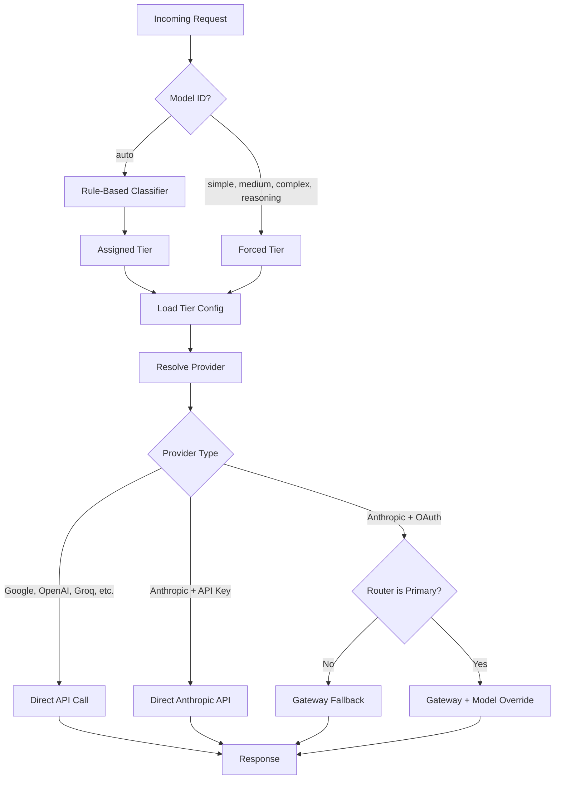

# Claw LLM Router

An [OpenClaw](https://openclaw.ai) plugin that classifies prompts by complexity and routes them to the cheapest capable model. Simple questions go to fast/cheap models; complex tasks go to frontier models. All routing decisions happen locally in under 1ms.

## Why

LLM costs add up fast when every prompt hits a frontier model. Most prompts don't need one. "What is the capital of France?" doesn't need Claude Opus — Gemini Flash answers it for 100x less. The router makes this automatic: you interact with a single model (`claw-llm-router/auto`) and the classifier picks the right backend.

## How It Works



### The Four Tiers

| Tier          | Default Model                         | When It's Used                                                                   |
| ------------- | ------------------------------------- | -------------------------------------------------------------------------------- |
| **SIMPLE**    | `google/gemini-2.5-flash`             | Factual lookups, definitions, translations, greetings, yes/no, simple math       |
| **MEDIUM**    | `anthropic/claude-haiku-4-5-20251001` | Code snippets, explanations, summaries, moderate analysis                        |
| **COMPLEX**   | `anthropic/claude-sonnet-4-6`         | Multi-file code, architecture, long-form analysis, detailed technical work       |
| **REASONING** | `anthropic/claude-opus-4-6`           | Mathematical proofs, formal logic, multi-step derivations, deep chain-of-thought |

Every tier is configurable. Any OpenAI-compatible provider works, plus Anthropic's native Messages API.

### Classification

The classifier scores prompts across 15 weighted dimensions:

| Dimension             | Weight | What It Detects                                       |
| --------------------- | ------ | ----------------------------------------------------- |
| Reasoning markers     | 0.18   | "prove", "theorem", "derive", "step by step"          |
| Code presence         | 0.15   | `function`, `class`, `import`, backtick blocks        |
| Technical terms       | 0.13   | "algorithm", "kubernetes", "distributed"              |
| Multi-step patterns   | 0.10   | "first...then", "step 1", numbered lists              |
| Token count           | 0.08   | Short prompts pull toward SIMPLE, long toward COMPLEX |
| Agentic tasks         | 0.06   | "read file", "edit", "deploy", "fix", "debug"         |
| Imperative verbs      | 0.05   | "build", "create", "implement", "design"              |
| Creative markers      | 0.04   | "story", "poem", "brainstorm", "write a"              |
| Question complexity   | 0.04   | Multiple question marks                               |
| Constraint indicators | 0.04   | "at most", "within", "budget", "maximum"              |
| Output format         | 0.03   | "json", "yaml", "table", "csv"                        |
| Simple indicators     | 0.02   | "what is", "define", "who is", "capital of"           |
| Reference complexity  | 0.02   | "the code", "above", "the api"                        |
| Domain specificity    | 0.02   | "quantum", "fpga", "genomics", "zero-knowledge"       |
| Negation complexity   | 0.01   | "don't", "avoid", "except", "exclude"                 |

Scores map to tiers via boundaries (SIMPLE < 0.0, MEDIUM < 0.3, COMPLEX < 0.5, REASONING >= 0.5). The MEDIUM band is intentionally wide (0.30) so ambiguous prompts land confidently within it — no external LLM calls needed.

### Fallback Chain

If a provider call fails, the router tries the next tier up:

```
SIMPLE → MEDIUM → COMPLEX
MEDIUM → COMPLEX
COMPLEX → REASONING
REASONING → (no fallback)
```

## Architecture

See [docs/ARCHITECTURE.md](docs/ARCHITECTURE.md) for provider strategy, resolution logic, and the OAuth model override mechanism.

## Quickstart

### 1. Install the plugin

Copy to your OpenClaw extensions directory:

```bash
cp -r claw-llm-router ~/.openclaw/extensions/
```

Enable it in `~/.openclaw/openclaw.json`:

```json
{
  "plugins": {
    "allow": ["claw-llm-router"],
    "entries": {
      "claw-llm-router": { "enabled": true }
    }
  }
}
```

### 2. Set up API keys

The router needs at least one provider API key. Set keys for the providers you want to use:

| Provider  | Environment Variable                     | Tier Suggestion            |
| --------- | ---------------------------------------- | -------------------------- |
| Google    | `GEMINI_API_KEY`                         | SIMPLE                     |
| Anthropic | `ANTHROPIC_API_KEY` or OAuth via `/auth` | MEDIUM, COMPLEX, REASONING |
| OpenAI    | `OPENAI_API_KEY`                         | MEDIUM, COMPLEX            |
| Groq      | `GROQ_API_KEY`                           | SIMPLE                     |
| xAI       | `XAI_API_KEY`                            | MEDIUM                     |

You can also add credentials through OpenClaw's `/auth` command.

> **Tip:** At minimum, set `GEMINI_API_KEY` for the SIMPLE tier and authenticate Anthropic via `/auth` for the other tiers. This covers all four tiers.

### 3. Restart and verify

```bash
openclaw gateway restart
```

Then run the doctor to verify everything is working:

```
/router doctor
```

### 4. Set as primary model (recommended)

To route all prompts through the router automatically, set it as the primary model in `~/.openclaw/openclaw.json`:

```json
{
  "agents": {
    "defaults": {
      "model": {
        "primary": "claw-llm-router/auto"
      }
    }
  }
}
```

Restart the gateway after this change.

### Configure Tiers

Use the `/router` command in any OpenClaw chat:

```
/router setup              # Show current config + suggestions
/router set SIMPLE google/gemini-2.5-flash
/router set MEDIUM anthropic/claude-haiku-4-5-20251001
/router set COMPLEX anthropic/claude-sonnet-4-6
/router set REASONING anthropic/claude-opus-4-6
/router doctor             # Diagnose config, auth, and proxy issues
```

### API Key Resolution

The router reads API keys from OpenClaw's existing auth stores (never stores its own). Priority order:

1. Environment variable (e.g., `GEMINI_API_KEY`, `ANTHROPIC_API_KEY`, `XAI_API_KEY`, `MOONSHOT_API_KEY`)
2. `~/.openclaw/agents/main/agent/auth-profiles.json`
3. `~/.openclaw/agents/main/agent/auth.json`
4. `~/.openclaw/openclaw.json` `env.vars` section

## Usage

### `/router` Command

The `/router` slash command manages the router from any OpenClaw chat. No gateway restart needed for tier changes — they take effect on the next request.

| Command                               | What It Does                                                |
| ------------------------------------- | ----------------------------------------------------------- |
| `/router`                             | Show status: uptime, proxy health, current tier assignments |
| `/router help`                        | List all subcommands with examples                          |
| `/router setup`                       | Show current config with suggested models per tier          |
| `/router set <TIER> <provider/model>` | Change a tier's model                                       |
| `/router doctor`                      | Diagnose config, API keys, base URLs, and proxy health      |

Common workflows:

```
# Check what's running
/router

# Something broken? Run the doctor
/router doctor

# Swap SIMPLE tier to a different model
/router set SIMPLE groq/llama-3.3-70b-versatile

# See all options and suggested models
/router setup
```

### Model Selection

Switch to the router model in any chat:

```
/model claw-llm-router/auto
```

Or force a specific tier (useful for testing or when you know the complexity):

```
/model claw-llm-router/simple      # Always use the cheapest model
/model claw-llm-router/complex     # Skip classification, go straight to capable
/model claw-llm-router/reasoning   # Force frontier reasoning model
```

### Via curl

The proxy runs on `http://127.0.0.1:8401` and speaks the OpenAI chat completions API:

```bash
# Auto-classify
curl -s http://127.0.0.1:8401/v1/chat/completions \
  -H "Content-Type: application/json" \
  -d '{
    "model": "auto",
    "messages": [{"role": "user", "content": "What is 2+2?"}],
    "max_tokens": 50
  }'

# Force a tier
curl -s http://127.0.0.1:8401/v1/chat/completions \
  -H "Content-Type: application/json" \
  -d '{
    "model": "complex",
    "messages": [{"role": "user", "content": "Design a microservice architecture"}],
    "max_tokens": 500
  }'

# Streaming
curl -s http://127.0.0.1:8401/v1/chat/completions \
  -H "Content-Type: application/json" \
  -d '{
    "model": "auto",
    "messages": [{"role": "user", "content": "Hello!"}],
    "stream": true
  }'
```

### Endpoints

| Endpoint               | Method | Description                          |
| ---------------------- | ------ | ------------------------------------ |
| `/v1/chat/completions` | POST   | Chat completions (OpenAI-compatible) |
| `/v1/models`           | GET    | List available models                |
| `/health`              | GET    | Health check                         |

### Virtual Model IDs

| Model ID    | Behavior                         |
| ----------- | -------------------------------- |
| `auto`      | Classify and route automatically |
| `simple`    | Force SIMPLE tier                |
| `medium`    | Force MEDIUM tier                |
| `complex`   | Force COMPLEX tier               |
| `reasoning` | Force REASONING tier             |

## Troubleshooting

Run the built-in doctor to check your setup:

```
/router doctor
```

It verifies:

- Config file exists and all 4 tiers are configured
- Each tier has a valid `provider/model-id` format, resolvable base URL, and available API key
- Proxy is running and healthy on port 8401
- Whether the router is set as the primary model

Any issues are flagged with fix instructions (e.g., which env var to set, how to add a custom provider).

## Project Structure

```
claw-llm-router/
├── index.ts                  # Plugin entry point, OpenClaw registration
├── proxy.ts                  # HTTP proxy server, request routing
├── classifier.ts             # Rule-based prompt classifier (15 dimensions)
├── tier-config.ts            # Tier-to-model config, API key loading
├── models.ts                 # Model definitions, provider constants
├── provider.ts               # OpenClaw provider plugin definition
├── router-config.json        # Tier configuration (auto-generated)
├── router-logger.ts          # RouterLogger class — centralized log formatting
├── openclaw.plugin.json      # Plugin manifest
├── docs/
│   ├── ARCHITECTURE.md       # Provider strategy, OAuth override mechanism
│   ├── CLASSIFIER.md         # Classifier dimensions, weights, extraction
│   └── PROVIDERS.md          # Step-by-step guide for adding providers
├── providers/
│   ├── types.ts              # LLMProvider interface, shared types
│   ├── openai-compatible.ts  # Google, OpenAI, Groq, Mistral, etc.
│   ├── anthropic.ts          # Anthropic Messages API (direct key)
│   ├── gateway.ts            # OpenClaw gateway fallback (OAuth)
│   ├── model-override.ts     # In-process override store for recursion prevention
│   └── index.ts              # Provider registry + resolution
└── tests/
    ├── classifier.test.ts
    ├── proxy.test.ts
    ├── tier-config.test.ts
    └── providers/
        ├── anthropic.test.ts
        ├── gateway.test.ts
        ├── openai-compatible.test.ts
        ├── model-override.test.ts
        └── registry.test.ts
```

## Testing

Tests use Node.js built-in test runner (`node:test`). No external test dependencies.

```bash
# Run all tests
npx tsx --test tests/providers/*.test.ts tests/classifier.test.ts tests/proxy.test.ts tests/tier-config.test.ts

# Provider tests only
npx tsx --test tests/providers/*.test.ts

# Classifier tests only
npx tsx --test tests/classifier.test.ts
```

133 tests covering: provider resolution, Anthropic format conversion, streaming SSE, request sanitization, classification boundaries, model override store, proxy routing, doctor diagnostics, and tier config auth.

## Adding a New Provider

See [docs/PROVIDERS.md](docs/PROVIDERS.md) for a step-by-step guide to implementing a new provider.

## License

MIT
