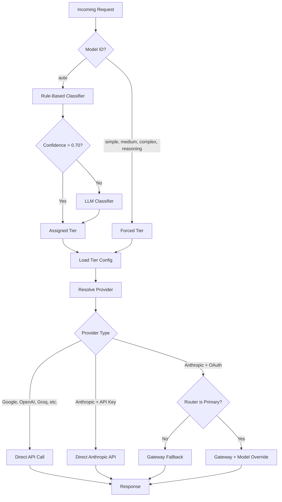
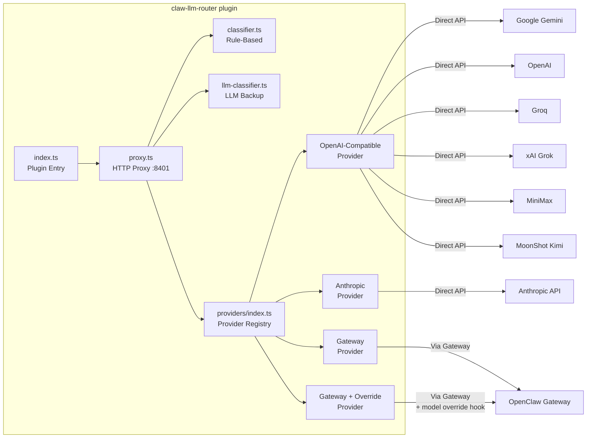
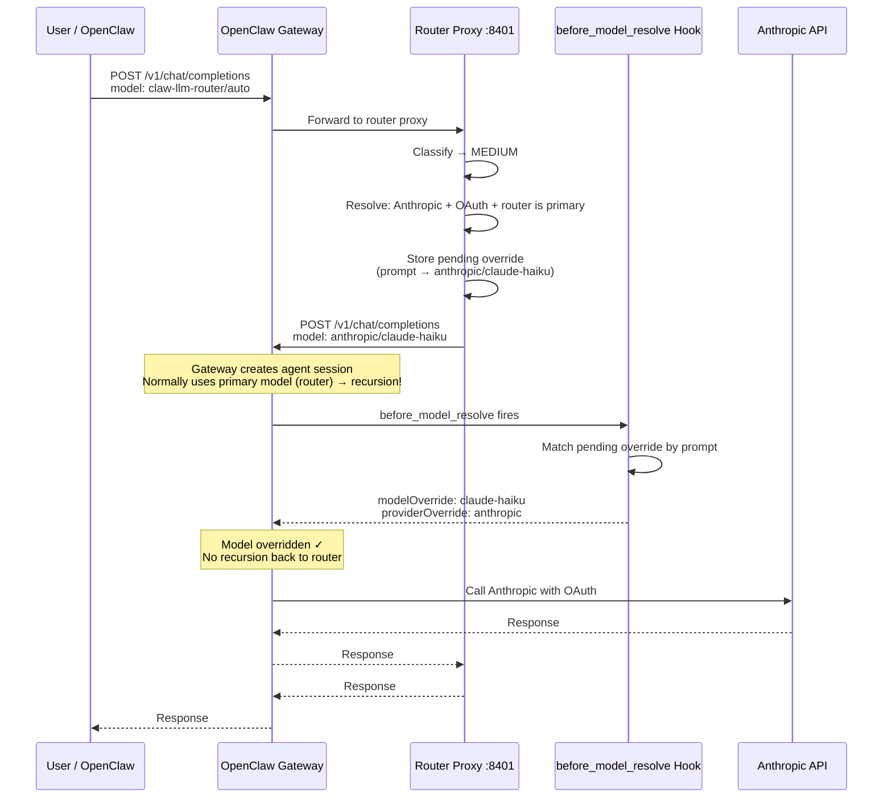

# Claw LLM Router

An [OpenClaw](https://openclaw.ai) plugin that classifies prompts by complexity and routes them to the cheapest capable model. Simple questions go to fast/cheap models; complex tasks go to frontier models. All routing decisions happen locally in under 1ms.

## Why

LLM costs add up fast when every prompt hits a frontier model. Most prompts don't need one. "What is the capital of France?" doesn't need Claude Opus — Gemini Flash answers it for 100x less. The router makes this automatic: you interact with a single model (`claw-llm-router/auto`) and the classifier picks the right backend.

## How It Works



### The Four Tiers

| Tier | Default Model | When It's Used |
|------|--------------|----------------|
| **SIMPLE** | `google/gemini-2.5-flash` | Factual lookups, definitions, translations, greetings, yes/no, simple math |
| **MEDIUM** | `anthropic/claude-haiku-4-5-20251001` | Code snippets, explanations, summaries, moderate analysis |
| **COMPLEX** | `anthropic/claude-sonnet-4-6` | Multi-file code, architecture, long-form analysis, detailed technical work |
| **REASONING** | `anthropic/claude-opus-4-6` | Mathematical proofs, formal logic, multi-step derivations, deep chain-of-thought |

Every tier is configurable. Any OpenAI-compatible provider works, plus Anthropic's native Messages API.

### Classification

The classifier scores prompts across 15 weighted dimensions:

| Dimension | Weight | What It Detects |
|-----------|--------|----------------|
| Reasoning markers | 0.18 | "prove", "theorem", "derive", "step by step" |
| Code presence | 0.15 | `function`, `class`, `import`, backtick blocks |
| Technical terms | 0.13 | "algorithm", "kubernetes", "distributed" |
| Multi-step patterns | 0.10 | "first...then", "step 1", numbered lists |
| Token count | 0.08 | Short prompts pull toward SIMPLE, long toward COMPLEX |
| Agentic tasks | 0.06 | "read file", "edit", "deploy", "fix", "debug" |
| Imperative verbs | 0.05 | "build", "create", "implement", "design" |
| Creative markers | 0.04 | "story", "poem", "brainstorm", "write a" |
| Question complexity | 0.04 | Multiple question marks |
| Constraint indicators | 0.04 | "at most", "within", "budget", "maximum" |
| Output format | 0.03 | "json", "yaml", "table", "csv" |
| Simple indicators | 0.02 | "what is", "define", "who is", "capital of" |
| Reference complexity | 0.02 | "the code", "above", "the api" |
| Domain specificity | 0.02 | "quantum", "fpga", "genomics", "zero-knowledge" |
| Negation complexity | 0.01 | "don't", "avoid", "except", "exclude" |

Scores map to tiers via boundaries (SIMPLE < 0.0, MEDIUM < 0.15, COMPLEX < 0.35, REASONING >= 0.35). When confidence is low (< 0.70), a cheap LLM call confirms the classification.

### Fallback Chain

If a provider call fails, the router tries the next tier up:

```
SIMPLE → MEDIUM → COMPLEX
MEDIUM → COMPLEX
COMPLEX → REASONING
REASONING → (no fallback)
```

## Architecture



### Provider Strategy

All providers implement the `LLMProvider` interface:

```typescript
interface LLMProvider {
  readonly name: string;
  chatCompletion(
    body: Record<string, unknown>,
    spec: { modelId: string; apiKey: string; baseUrl: string },
    stream: boolean,
    res: ServerResponse,
    log: PluginLogger,
  ): Promise<void>;
}
```

Provider resolution:

| Condition | Provider | How It Works |
|-----------|----------|-------------|
| Any provider + OAuth token | `GatewayProvider` | Routes through OpenClaw gateway (handles token refresh + API format) |
| Any provider + OAuth + router is primary model | `gateway-with-override` | Gateway call with `before_model_resolve` hook to prevent recursion |
| Anthropic + direct API key | `AnthropicProvider` | Converts OpenAI format to Anthropic Messages API |
| All other providers | `OpenAICompatibleProvider` | POST to `{baseUrl}/chat/completions` with Bearer auth |

### OAuth Model Override (Recursion Prevention)

When the router is set as OpenClaw's primary model and Anthropic uses an OAuth token, a naive gateway call would cause infinite recursion:



The override uses an in-process `Map` keyed by the first 500 characters of the user prompt. Entries auto-expire after 30 seconds.

## Setup

### Prerequisites

- [OpenClaw](https://openclaw.ai) installed and running
- At least one LLM provider API key configured

### Install

Copy the plugin to your OpenClaw extensions directory:

```bash
cp -r claw-llm-router ~/.openclaw/extensions/
```

Enable it in `~/.openclaw/openclaw.json`:

```json
{
  "plugins": {
    "allow": ["claw-llm-router"],
    "entries": {
      "claw-llm-router": { "enabled": true }
    }
  }
}
```

Restart the gateway:

```bash
openclaw gateway restart
```

### Configure Tiers

Use the `/router` command in any OpenClaw chat:

```
/router setup              # Show current config + suggestions
/router set SIMPLE google/gemini-2.5-flash
/router set MEDIUM anthropic/claude-haiku-4-5-20251001
/router set COMPLEX anthropic/claude-sonnet-4-6
/router set REASONING anthropic/claude-opus-4-6
```

### Set as Primary Model

To use the router for all prompts, set it as the primary model in `~/.openclaw/openclaw.json`:

```json
{
  "agents": {
    "defaults": {
      "model": {
        "primary": "claw-llm-router/auto"
      }
    }
  }
}
```

Then restart the gateway. The router handles OAuth tokens automatically via the model override mechanism.

### API Keys

The router reads API keys from OpenClaw's existing auth stores (never stores its own). Priority order:

1. Environment variable (e.g., `GEMINI_API_KEY`, `ANTHROPIC_API_KEY`, `XAI_API_KEY`, `MOONSHOT_API_KEY`)
2. `~/.openclaw/agents/main/agent/auth-profiles.json`
3. `~/.openclaw/agents/main/agent/auth.json`
4. `~/.openclaw/openclaw.json` `env.vars` section

## Usage

### Via OpenClaw

Switch to the router model in any chat:

```
/model claw-llm-router/auto
```

Or force a specific tier:

```
/model claw-llm-router/simple
/model claw-llm-router/complex
```

### Via curl

The proxy runs on `http://127.0.0.1:8401` and speaks the OpenAI chat completions API:

```bash
# Auto-classify
curl -s http://127.0.0.1:8401/v1/chat/completions \
  -H "Content-Type: application/json" \
  -d '{
    "model": "auto",
    "messages": [{"role": "user", "content": "What is 2+2?"}],
    "max_tokens": 50
  }'

# Force a tier
curl -s http://127.0.0.1:8401/v1/chat/completions \
  -H "Content-Type: application/json" \
  -d '{
    "model": "complex",
    "messages": [{"role": "user", "content": "Design a microservice architecture"}],
    "max_tokens": 500
  }'

# Streaming
curl -s http://127.0.0.1:8401/v1/chat/completions \
  -H "Content-Type: application/json" \
  -d '{
    "model": "auto",
    "messages": [{"role": "user", "content": "Hello!"}],
    "stream": true
  }'
```

### Endpoints

| Endpoint | Method | Description |
|----------|--------|-------------|
| `/v1/chat/completions` | POST | Chat completions (OpenAI-compatible) |
| `/v1/models` | GET | List available models |
| `/health` | GET | Health check |

### Virtual Model IDs

| Model ID | Behavior |
|----------|----------|
| `auto` | Classify and route automatically |
| `simple` | Force SIMPLE tier |
| `medium` | Force MEDIUM tier |
| `complex` | Force COMPLEX tier |
| `reasoning` | Force REASONING tier |

## Project Structure

```
claw-llm-router/
├── index.ts                  # Plugin entry point, OpenClaw registration
├── proxy.ts                  # HTTP proxy server, request routing
├── classifier.ts             # Rule-based prompt classifier (15 dimensions)
├── llm-classifier.ts         # LLM-based classifier for ambiguous prompts
├── tier-config.ts            # Tier-to-model config, API key loading
├── models.ts                 # Model definitions, provider constants
├── provider.ts               # OpenClaw provider plugin definition
├── router-config.json        # Tier configuration (auto-generated)
├── openclaw.plugin.json      # Plugin manifest
├── providers/
│   ├── types.ts              # LLMProvider interface, shared types
│   ├── openai-compatible.ts  # Google, OpenAI, Groq, Mistral, etc.
│   ├── anthropic.ts          # Anthropic Messages API (direct key)
│   ├── gateway.ts            # OpenClaw gateway fallback (OAuth)
│   ├── model-override.ts     # In-process override store for recursion prevention
│   └── index.ts              # Provider registry + resolution
└── tests/
    ├── classifier.test.ts
    ├── proxy.test.ts
    └── providers/
        ├── anthropic.test.ts
        ├── gateway.test.ts
        ├── openai-compatible.test.ts
        ├── model-override.test.ts
        └── registry.test.ts
```

## Testing

Tests use Node.js built-in test runner (`node:test`). No external test dependencies.

```bash
# Run all tests
npx tsx --test tests/providers/*.test.ts tests/classifier.test.ts tests/proxy.test.ts

# Provider tests only
npx tsx --test tests/providers/*.test.ts

# Classifier tests only
npx tsx --test tests/classifier.test.ts
```

97 tests covering: provider resolution, Anthropic format conversion, streaming SSE, request sanitization, classification boundaries, model override store, and proxy routing.

## Adding a New Provider

See [PROVIDERS.md](PROVIDERS.md) for a step-by-step guide to implementing a new provider.

## License

MIT
