# Claw LLM Router

An [OpenClaw](https://openclaw.ai) plugin that cuts LLM costs **40–80%** by classifying prompts and routing them to the cheapest capable model. Simple questions go to fast/cheap models (Gemini Flash at ~$0.15/1M tokens); complex tasks go to frontier models. All routing happens locally, super fast.

> **🚨 Warning:** This plugin modifies `~/.openclaw/openclaw.json` at startup to register itself as a provider. If misconfigured, this can leave your gateway in a broken state. A backup is created automatically before each write (see [Config Backup & Restore](#config-backup--restore)), but proceed with caution — make sure your API keys are set up **before** restarting the gateway. Read the [Quickstart](#quickstart) carefully. 🚨

## Table of Contents

- [How It Works](#how-it-works) — tiers, providers, classification, fallback chain
- [Quickstart / Install](#quickstart) — API keys, install, gateway restart, primary model setup
- [Usage](#usage) — `/router` command, model selection, curl examples, endpoints
- [Troubleshooting](#troubleshooting) — doctor, config backup & restore, disable/uninstall
- [Testing](#testing)
- [Adding a New Provider](#adding-a-new-provider)

## Why

LLM costs add up fast when every prompt hits a frontier model. Most prompts don't need one. "What is the capital of France?" doesn't need Claude Opus — Gemini Flash answers it for 100x less. The router makes this automatic: you interact with a single model (`claw-llm-router/auto`) and the classifier picks the right backend.

## How It Works

The router runs as a **local HTTP proxy** inside the OpenClaw gateway process on port 8401. When you set it as the primary model, OpenClaw sends all chat completion requests to the router instead of directly to a provider. The router then:

1. **Classifies** the prompt locally using a rule-based scorer (no external API calls, super fast)
2. **Picks a tier** (SIMPLE, MEDIUM, COMPLEX, or REASONING) based on the score
3. **Forwards** the request to the provider/model assigned to that tier using your API keys
4. **Falls back** to a higher tier if the chosen provider fails

The result: simple prompts go to cheap models, complex prompts go to capable ones, and you don't have to think about it.

```mermaid
sequenceDiagram
    participant User
    participant OpenClaw as OpenClaw Gateway
    participant Router as Router Proxy (port 8401)
    participant Provider as LLM Provider

    User->>OpenClaw: Send message
    OpenClaw->>Router: POST /v1/chat/completions
    Router->>Router: Classify prompt → pick tier
    Router->>Provider: Forward to tier's provider/model
    Provider-->>Router: Stream response
    Router-->>OpenClaw: Pipe response
    OpenClaw-->>User: Display response
```



### Routing


### The Four Tiers

Each tier maps to a model. These are the defaults — you can point any tier at any supported provider/model with `/router set`:

| Tier          | Default Model                         | When It's Used                                                                   |
| ------------- | ------------------------------------- | -------------------------------------------------------------------------------- |
| **SIMPLE**    | `google/gemini-2.5-flash`             | Factual lookups, definitions, translations, greetings, yes/no, simple math       |
| **MEDIUM**    | `anthropic/claude-haiku-4-5-20251001` | Code snippets, explanations, summaries, moderate analysis                        |
| **COMPLEX**   | `anthropic/claude-sonnet-4-6`         | Multi-file code, architecture, long-form analysis, detailed technical work       |
| **REASONING** | `anthropic/claude-opus-4-6`           | Mathematical proofs, formal logic, multi-step derivations, deep chain-of-thought |

### Supported Providers

The router works with any OpenAI-compatible API out of the box, plus Anthropic's native Messages API. These providers have built-in support (no base URL configuration needed):

| Provider   | Environment Variable | Example Models                                       |
| ---------- | -------------------- | ---------------------------------------------------- |
| Anthropic  | `ANTHROPIC_API_KEY`  | claude-opus-4-6, claude-sonnet-4-6, claude-haiku-4-5 |
| Google     | `GEMINI_API_KEY`     | gemini-2.5-flash, gemini-2.5-pro                     |
| OpenAI     | `OPENAI_API_KEY`     | gpt-4o, gpt-4o-mini, o1, o3-mini                     |
| Groq       | `GROQ_API_KEY`       | llama-3.3-70b, mixtral-8x7b                          |
| Mistral    | `MISTRAL_API_KEY`    | mistral-large, mistral-small                         |
| DeepSeek   | `DEEPSEEK_API_KEY`   | deepseek-chat, deepseek-reasoner                     |
| xAI        | `XAI_API_KEY`        | grok-2, grok-3                                       |
| Together   | `TOGETHER_API_KEY`   | meta-llama/Llama-3.3-70B-Instruct                    |
| Fireworks  | `FIREWORKS_API_KEY`  | accounts/fireworks/models/llama-v3p3-70b-instruct    |
| Perplexity | `PERPLEXITY_API_KEY` | sonar, sonar-pro                                     |
| MiniMax    | via `/auth`          | MiniMax-Text-01                                      |
| MoonShot   | `MOONSHOT_API_KEY`   | moonshot-v1-auto                                     |

Any other OpenAI-compatible provider can be added by configuring a custom base URL in `~/.openclaw/openclaw.json`. See [docs/PROVIDERS.md](docs/PROVIDERS.md) for the full guide on adding new providers.

### Classification

The classifier scores prompts across 15 weighted dimensions:

| Dimension             | Weight | What It Detects                                       |
| --------------------- | ------ | ----------------------------------------------------- |
| Reasoning markers     | 0.18   | "prove", "theorem", "derive", "step by step"          |
| Code presence         | 0.15   | `function`, `class`, `import`, backtick blocks        |
| Technical terms       | 0.13   | "algorithm", "kubernetes", "distributed"              |
| Multi-step patterns   | 0.10   | "first...then", "step 1", numbered lists              |
| Token count           | 0.08   | Short prompts pull toward SIMPLE, long toward COMPLEX |
| Agentic tasks         | 0.06   | "read file", "edit", "deploy", "fix", "debug"         |
| Imperative verbs      | 0.05   | "build", "create", "implement", "design"              |
| Creative markers      | 0.04   | "story", "poem", "brainstorm", "write a"              |
| Question complexity   | 0.04   | Multiple question marks                               |
| Constraint indicators | 0.04   | "at most", "within", "budget", "maximum"              |
| Output format         | 0.03   | "json", "yaml", "table", "csv"                        |
| Simple indicators     | 0.02   | "what is", "define", "who is", "capital of"           |
| Reference complexity  | 0.02   | "the code", "above", "the api"                        |
| Domain specificity    | 0.02   | "quantum", "fpga", "genomics", "zero-knowledge"       |
| Negation complexity   | 0.01   | "don't", "avoid", "except", "exclude"                 |

Scores map to tiers via boundaries (SIMPLE < 0.0, MEDIUM < 0.3, COMPLEX < 0.5, REASONING >= 0.5). The MEDIUM band is intentionally wide (0.30) so ambiguous prompts land confidently within it — no external LLM calls needed.

### Fallback Chain

If a provider call fails, the router tries the next tier up:

```
SIMPLE → MEDIUM → COMPLEX
MEDIUM → COMPLEX
COMPLEX → REASONING
REASONING → (no fallback)
```

## Architecture

See [docs/ARCHITECTURE.md](docs/ARCHITECTURE.md) for provider strategy, resolution logic, and the OAuth model override mechanism.

## Quickstart

### 1. Set up API keys

Set up your provider API keys **before** installing the plugin. The router modifies `~/.openclaw/openclaw.json` at startup, and without valid keys in place the system can end up in a broken state. See [Config Backup & Restore](#config-backup--restore) if you need to recover.

A simple starting config is Google Gemini for the SIMPLE tier (cheap, fast) and Anthropic for everything else:

| Tier                       | Default Provider | Key Needed          |
| -------------------------- | ---------------- | ------------------- |
| SIMPLE                     | Google           | `GEMINI_API_KEY`    |
| MEDIUM, COMPLEX, REASONING | Anthropic        | `ANTHROPIC_API_KEY` |

This is fully configurable — you can point any tier at any [supported provider](#supported-providers) with `/router set` (see [Configure Tiers](#configure-tiers)).

The router picks up API keys from several sources. These are listed in order of what's easiest to set up:

**Option A: `openclaw onboard`** (recommended)

If you haven't set up providers yet, run `openclaw onboard` — it walks you through configuring provider credentials interactively. The router picks up any credentials configured this way automatically.

**Option B: `openclaw.json` env section**

Add your keys to the `env` block in `~/.openclaw/openclaw.json`. You can place keys directly under `env` or nested under `env.vars` — both work:

```json5
{
  env: {
    GEMINI_API_KEY: "your-google-api-key",
    ANTHROPIC_API_KEY: "your-anthropic-api-key",
  },
}
```

**Option C: Environment variables**

As a fallback, you can set environment variables in your shell profile (`~/.bashrc`, `~/.zshrc`, etc.):

```bash
export GEMINI_API_KEY="your-google-api-key"
export ANTHROPIC_API_KEY="your-anthropic-api-key"
```

### 2. Install the plugin

```bash
openclaw plugins install claw-llm-router
```

Or install from a local directory during development:

```bash
openclaw plugins install -l ./claw-llm-router
```

### 3. Restart the gateway and verify

Restart the gateway so the plugin loads and registers its provider:

```bash
openclaw gateway restart
```

Then run the doctor to verify everything is working:

```
/router doctor
```

### 4. Set as primary model (recommended)

> **Note:** Without this step, the router is installed but won't be invoked by default. You'd need to manually select it each time with `/model claw-llm-router/auto`.

To route all prompts through the router automatically, set it as the primary model in `~/.openclaw/openclaw.json`:

```json
{
  "agents": {
    "defaults": {
      "model": {
        "primary": "claw-llm-router/auto"
      }
    }
  }
}
```

Restart the gateway after this change so it picks up the new primary model:

```bash
openclaw gateway restart
```

### Configure Tiers

Use the `/router` command in any OpenClaw chat:

```
/router setup              # Show current config + suggestions
/router set SIMPLE google/gemini-2.5-flash
/router set MEDIUM anthropic/claude-haiku-4-5-20251001
/router set COMPLEX anthropic/claude-sonnet-4-6
/router set REASONING anthropic/claude-opus-4-6
/router doctor             # Diagnose config, auth, and proxy issues
```

### API Key Resolution

The router reads API keys from OpenClaw's existing auth stores (never stores its own). Priority order:

1. Environment variable (e.g., `GEMINI_API_KEY`, `ANTHROPIC_API_KEY`, `XAI_API_KEY`, `MOONSHOT_API_KEY`)
2. `~/.openclaw/agents/main/agent/auth-profiles.json`
3. `~/.openclaw/agents/main/agent/auth.json`
4. `~/.openclaw/openclaw.json` `env.vars` section

## Usage

### `/router` Command

The `/router` slash command manages the router from any OpenClaw chat. No gateway restart needed for tier changes — they take effect on the next request.

| Command                               | What It Does                                                |
| ------------------------------------- | ----------------------------------------------------------- |
| `/router`                             | Show status: uptime, proxy health, current tier assignments |
| `/router help`                        | List all subcommands with examples                          |
| `/router setup`                       | Show current config with suggested models per tier          |
| `/router set <TIER> <provider/model>` | Change a tier's model                                       |
| `/router doctor`                      | Diagnose config, API keys, base URLs, and proxy health      |

Common workflows:

```
# Check what's running
/router

# Something broken? Run the doctor
/router doctor

# Swap SIMPLE tier to a different model
/router set SIMPLE groq/llama-3.3-70b-versatile

# See all options and suggested models
/router setup
```

### Model Selection

Switch to the router model in any chat:

```
/model claw-llm-router/auto
```

Or force a specific tier (useful for testing or when you know the complexity):

```
/model claw-llm-router/simple      # Always use the cheapest model
/model claw-llm-router/complex     # Skip classification, go straight to capable
/model claw-llm-router/reasoning   # Force frontier reasoning model
```

### Via curl

The proxy runs on `http://127.0.0.1:8401` and speaks the OpenAI chat completions API:

```bash
# Auto-classify
curl -s http://127.0.0.1:8401/v1/chat/completions \
  -H "Content-Type: application/json" \
  -d '{
    "model": "auto",
    "messages": [{"role": "user", "content": "What is 2+2?"}],
    "max_tokens": 50
  }'

# Force a tier
curl -s http://127.0.0.1:8401/v1/chat/completions \
  -H "Content-Type: application/json" \
  -d '{
    "model": "complex",
    "messages": [{"role": "user", "content": "Design a microservice architecture"}],
    "max_tokens": 500
  }'

# Streaming
curl -s http://127.0.0.1:8401/v1/chat/completions \
  -H "Content-Type: application/json" \
  -d '{
    "model": "auto",
    "messages": [{"role": "user", "content": "Hello!"}],
    "stream": true
  }'
```

### Endpoints

| Endpoint               | Method | Description                          |
| ---------------------- | ------ | ------------------------------------ |
| `/v1/chat/completions` | POST   | Chat completions (OpenAI-compatible) |
| `/v1/models`           | GET    | List available models                |
| `/health`              | GET    | Health check                         |

### Virtual Model IDs

| Model ID    | Behavior                         |
| ----------- | -------------------------------- |
| `auto`      | Classify and route automatically |
| `simple`    | Force SIMPLE tier                |
| `medium`    | Force MEDIUM tier                |
| `complex`   | Force COMPLEX tier               |
| `reasoning` | Force REASONING tier             |

## Troubleshooting

Run the built-in doctor to check your setup:

```
/router doctor
```

It verifies:

- Config file exists and all 4 tiers are configured
- Each tier has a valid `provider/model-id` format, resolvable base URL, and available API key
- Proxy is running and healthy on port 8401
- Whether the router is set as the primary model

Any issues are flagged with fix instructions (e.g., which env var to set, how to add a custom provider).

### Config Backup & Restore

Every time the router writes to `~/.openclaw/openclaw.json` (e.g., during first startup or config injection), it creates a timestamped backup first. Backups are identified by the `.bak.claw-llm-router.` infix in the filename:

```
~/.openclaw/openclaw.json.bak.claw-llm-router.<timestamp>
```

The **first** backup (oldest timestamp) is your original config from before the router ever modified anything. This is the one you want when doing a full uninstall. The **most recent** backup (newest timestamp) reflects the last known state before the router's latest write.

```bash
# List all router backups (most recent first)
ls -t ~/.openclaw/openclaw.json.bak.claw-llm-router.*

# Restore the original pre-router config (first backup ever made)
cp "$(ls -tr ~/.openclaw/openclaw.json.bak.claw-llm-router.* | head -1)" ~/.openclaw/openclaw.json

# Or restore the most recent backup
cp "$(ls -t ~/.openclaw/openclaw.json.bak.claw-llm-router.* | head -1)" ~/.openclaw/openclaw.json

# Restart the gateway so it picks up the restored config
openclaw gateway restart
```

### Disable or Uninstall

If the router is causing issues, you can quickly disable it without uninstalling:

```bash
openclaw plugins disable claw-llm-router
openclaw gateway restart
```

When disabling or uninstalling, you should also restore your `openclaw.json` to remove the provider config the router injected. The cleanest way is to restore from the first backup — your original config from before the router was ever installed:

```bash
# Restore original pre-router config
cp "$(ls -tr ~/.openclaw/openclaw.json.bak.claw-llm-router.* | head -1)" ~/.openclaw/openclaw.json
```

This also reverts the primary model setting if you changed it to `claw-llm-router/auto`.

To fully uninstall:

```bash
# 1. Restore original config
cp "$(ls -tr ~/.openclaw/openclaw.json.bak.claw-llm-router.* | head -1)" ~/.openclaw/openclaw.json

# 2. Remove the plugin
openclaw plugins uninstall claw-llm-router

# 3. Restart the gateway
openclaw gateway restart
```

To re-enable a disabled plugin:

```bash
openclaw plugins enable claw-llm-router
openclaw gateway restart
```

## Project Structure

```
claw-llm-router/
├── index.ts                  # Plugin entry point, OpenClaw registration
├── proxy.ts                  # HTTP proxy server, request routing
├── classifier.ts             # Rule-based prompt classifier (15 dimensions)
├── tier-config.ts            # Tier-to-model config, API key loading
├── models.ts                 # Model definitions, provider constants
├── provider.ts               # OpenClaw provider plugin definition
├── router-config.json        # Tier configuration (auto-generated)
├── router-logger.ts          # RouterLogger class — centralized log formatting
├── openclaw.plugin.json      # Plugin manifest
├── docs/
│   ├── ARCHITECTURE.md       # Provider strategy, OAuth override mechanism
│   ├── CLASSIFIER.md         # Classifier dimensions, weights, extraction
│   └── PROVIDERS.md          # Step-by-step guide for adding providers
├── providers/
│   ├── types.ts              # LLMProvider interface, shared types
│   ├── openai-compatible.ts  # Google, OpenAI, Groq, Mistral, etc.
│   ├── anthropic.ts          # Anthropic Messages API (direct key)
│   ├── gateway.ts            # OpenClaw gateway fallback (OAuth)
│   ├── model-override.ts     # In-process override store for recursion prevention
│   └── index.ts              # Provider registry + resolution
└── tests/
    ├── classifier.test.ts
    ├── proxy.test.ts
    ├── tier-config.test.ts
    └── providers/
        ├── anthropic.test.ts
        ├── gateway.test.ts
        ├── openai-compatible.test.ts
        ├── model-override.test.ts
        └── registry.test.ts
```

## Testing

Tests use Node.js built-in test runner (`node:test`). No external test dependencies.

```bash
# Run all tests
npx tsx --test tests/providers/*.test.ts tests/classifier.test.ts tests/proxy.test.ts tests/tier-config.test.ts

# Provider tests only
npx tsx --test tests/providers/*.test.ts

# Classifier tests only
npx tsx --test tests/classifier.test.ts
```

## Adding a New Provider

See [docs/PROVIDERS.md](docs/PROVIDERS.md) for a step-by-step guide to implementing a new provider.

## License

MIT
