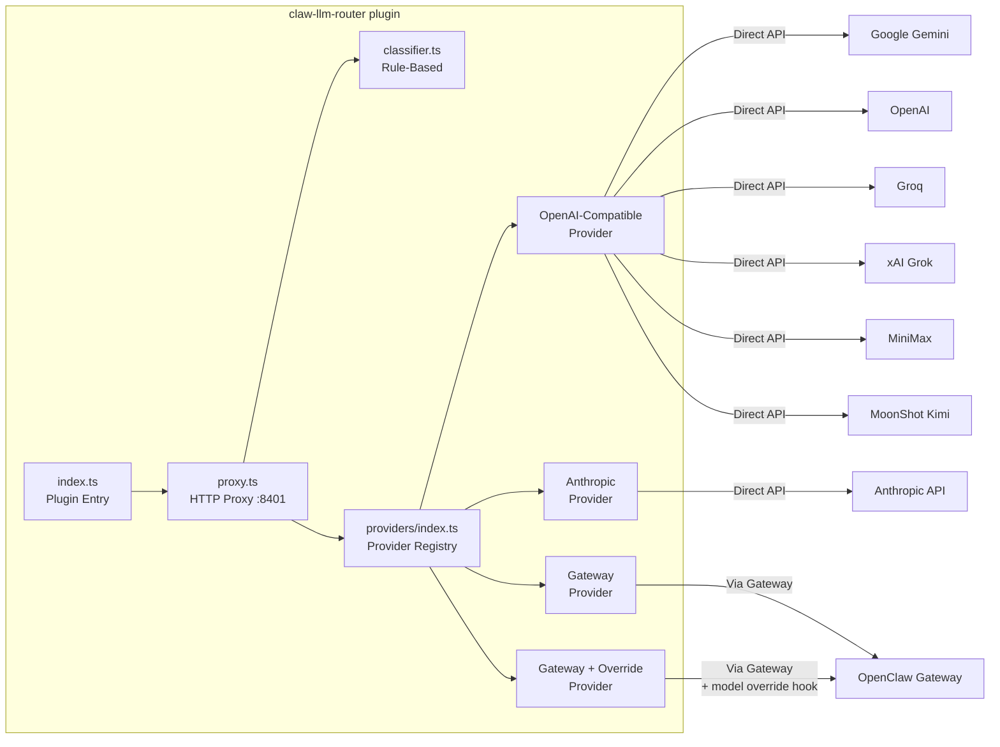
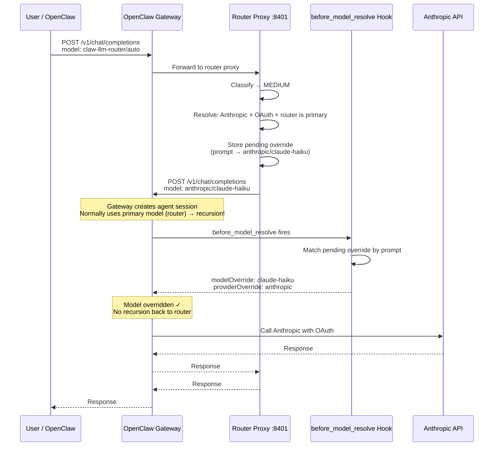

# Architecture



## Provider Strategy

All providers implement the `LLMProvider` interface:

```typescript
interface LLMProvider {
  readonly name: string;
  chatCompletion(
    body: Record<string, unknown>,
    spec: { modelId: string; apiKey: string; baseUrl: string },
    stream: boolean,
    res: ServerResponse,
    log: PluginLogger,
  ): Promise<void>;
}
```

Provider resolution:

| Condition                                      | Provider                   | How It Works                                                         |
| ---------------------------------------------- | -------------------------- | -------------------------------------------------------------------- |
| Any provider + OAuth token                     | `GatewayProvider`          | Routes through OpenClaw gateway (handles token refresh + API format) |
| Any provider + OAuth + router is primary model | `gateway-with-override`    | Gateway call with `before_model_resolve` hook to prevent recursion   |
| Anthropic + direct API key                     | `AnthropicProvider`        | Converts OpenAI format to Anthropic Messages API                     |
| All other providers                            | `OpenAICompatibleProvider` | POST to `{baseUrl}/chat/completions` with Bearer auth                |

## OAuth Model Override (Recursion Prevention)

When the router is set as OpenClaw's primary model and Anthropic uses an OAuth token, a naive gateway call would cause infinite recursion:



The override uses an in-process `Map` keyed by the first 500 characters of the user prompt. Entries auto-expire after 30 seconds.
